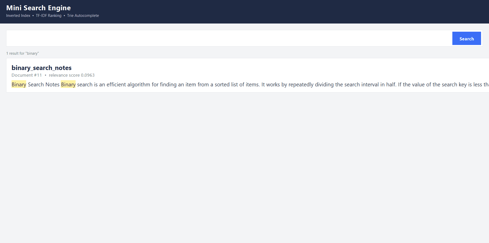

# Java Mini Search Engine

A desktop search engine built in Java Swing, featuring an inverted index
for fast document lookup, TF-IDF relevance ranking, Trie-based autocomplete,
and PDF/OCR document ingestion.

## Features
- Inverted Index (HashMap) for O(1) average word → document lookup
- TF-IDF ranking for relevance-based result ordering
- Trie-based autocomplete (O(L) prefix search)
- PDF text extraction via Apache PDFBox
- OCR fallback for scanned/image-based PDF pages using Tesseract
- Highlighted search terms in results

## Tech Stack
Java, Swing, Apache PDFBox, Tesseract OCR

## How to run
1. Clone this repo
2. Open in NetBeans (or compile manually with `javac src/search/engine/*.java`)
3. Run `Main.java`